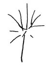

  
[Intangible Textual Heritage](../../index)  [Age of Reason](../index.md) 
[Index](index.md)   
[VIII. Botany for Painters and Elements of Landscape Painting
Index](dvs009.md)  
  [Previous](0431)  [Next](0433.md) 

------------------------------------------------------------------------

[Buy this Book at
Amazon.com](https://www.amazon.com/exec/obidos/ASIN/0486225720/internetsacredte.md)

------------------------------------------------------------------------

*The Da Vinci Notebooks at Intangible Textual Heritage*

### 432.

 

The willow and other similar trees, which have their boughs lopped every
3 or 4 years, put forth very straight branches, and their shadow is
about the middle where these boughs spring; and towards the extreme ends
they cast but little shade from having small leaves and few and slender
branches. Hence the boughs which rise towards the sky will have but
little shade and little relief; and the branches which are at an angle
from the horizon, downwards, spring from the dark part of the shadow and
grow thinner by degrees up to their ends, and these will be in strong
relief, being in gradations of light against a background of shadow.

That tree will have the least shadow which has the fewest branches and
few leaves.

------------------------------------------------------------------------

[Next: 433.](0433.md)
