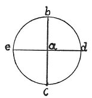

  
[Intangible Textual Heritage](../../index)  [Age of Reason](../index.md) 
[Index](index.md)   
[VIII. Botany for Painters and Elements of Landscape Painting
Index](dvs009.md)  
  [Previous](0444)  [Next](0446.md) 

------------------------------------------------------------------------

[Buy this Book at
Amazon.com](https://www.amazon.com/exec/obidos/ASIN/0486225720/internetsacredte.md)

------------------------------------------------------------------------

*The Da Vinci Notebooks at Intangible Textual Heritage*

### 445.

p. 224

 

### OF THE 4 POINTS OF THE COMPASS \[IN LANDSCAPES\].

When the sun is in the East all the portions of plants lighted by it are
of a most lively verdure, and this happens because the leaves lighted by
the sun within the half of the horizon that is the Eastern half, are
transparent; and within the Western semicircle the verdure is of a dull
hue and the moist air is turbid and of the colour of grey ashes, not
being transparent like that in the East, which is quite clear and all
the more so in proportion as it is moister.

The shadows of the trees to the East cover a large portion of them and
are darker in proportion as the foliage of the trees is thicker.

------------------------------------------------------------------------

[Next: 446.](0446.md)
