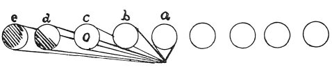

  
[Intangible Textual Heritage](../../index)  [Age of Reason](../index) 
[Index](index)   
[VIII. Botany for Painters and Elements of Landscape Painting
Index](dvs009)  
  [Previous](0449)  [Next](0451) 

------------------------------------------------------------------------

[Buy this Book at
Amazon.com](https://www.amazon.com/exec/obidos/ASIN/0486225720/internetsacredte)

------------------------------------------------------------------------

*The Da Vinci Notebooks at Intangible Textual Heritage*

### 450.

p. 226

### OF THE SPACES \[SHOWING THE SKY\] IN TREES THEMSELVES.

 The appearance of trees in the distance (450.
451).The spaces between the parts in the mass of trees, and the
spaces between the trees in the air, are, at great distances, invisible
to the eye; for, where it is an effort \[even\] to see the whole it is
most difficult to discern the parts.--But a confused mixture is the
result, partaking chiefly of the \[hue\] which predominates. The spaces
between the leaves consist of particles of illuminated air which are
very much smaller than the tree and are lost sight of sooner than the
tree; but it does not therefore follow that they are not there. Hence,
necessarily, a compounded \[effect\] is produced of the sky and of the
shadows of the tree in shade, which both together strike the eye which
sees them.

### OF TREES WHICH CONCEAL THESE SPACES IN ONE ANOTHER.

 

That part of a tree will show the fewest spaces, behind which a large
number of trees are standing between the tree and the air \[sky\]; thus
in the tree *a* the spaces are not concealed nor in *b*, as there is no
tree behind. But in *c* only half shows the spaces filled up by the tree
*d*, and part of the tree *d* is filled up by the tree *e* and a little
farther on all the spaces in the mass of the trees are lost, and only
that at the side remains.

------------------------------------------------------------------------

[Next: 451.](0451)
