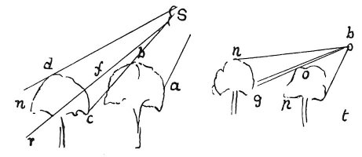

  
[Intangible Textual Heritage](../../index)  [Age of Reason](../index) 
[Index](index)   
[VIII. Botany for Painters and Elements of Landscape Painting
Index](dvs009)  
  [Previous](0454)  [Next](0456) 

------------------------------------------------------------------------

[Buy this Book at
Amazon.com](https://www.amazon.com/exec/obidos/ASIN/0486225720/internetsacredte)

------------------------------------------------------------------------

*The Da Vinci Notebooks at Intangible Textual Heritage*

### 455.

Of trees seen from below and against the light, one beyond the other and
near together. The topmost part of the first will be in great part
transparent and light, and will stand out against the dark portion of
the second tree. And thus it will be with all in succession that are
placed under the same conditions.

Let *s* be the light, and *r* the eye, *c d n* the first tree, *a b c*
the second. Then I say that *r*, the eye, will see the portion *c f*

 

in great part transparent and lighted by the light *s* which falls upon
it from the opposite side, and it will see it, on a dark ground *b c*
because that is the dark part and shadow of the tree *a b c*.

But if the eye is placed at *t* it will see *o p* dark on the light
background *n g*.

Of the transparent and shadowy parts of trees, that which is nearest to
you is the darkest.

------------------------------------------------------------------------

[Next: 456.](0456)
