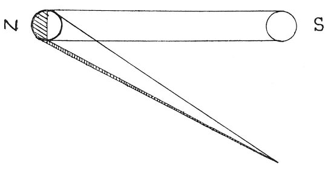

  
[Intangible Textual Heritage](../../index)  [Age of Reason](../index) 
[Index](index)   
[VIII. Botany for Painters and Elements of Landscape Painting
Index](dvs009)  
  [Previous](0457)  [Next](0459) 

------------------------------------------------------------------------

[Buy this Book at
Amazon.com](https://www.amazon.com/exec/obidos/ASIN/0486225720/internetsacredte)

------------------------------------------------------------------------

*The Da Vinci Notebooks at Intangible Textual Heritage*

### 458.

 On the treatment of light for landscapes
(458-464).The landscape has a finer azure \[tone\] when, in fine
weather the sun is at noon than at any other time of the day, because
the air is purified of moisture; and looking at it under that aspect you
will see the trees of a beautiful green at the outside and the shadows
dark towards the middle; and in

 

the remoter distance the atmosphere which comes between you and them
looks more beautiful when there is something dark beyond. And still the
azure is most beautiful. The objects seen from the side on which the sun
shines will not show you their shadows. But, if you are lower than the
sun, you can see what is not seen by the sun and that will be all in
shade. The leaves of the trees, which come between you and the sun are
of two principal colours which are a splendid lustre of green, and the
reflection of the atmosphere which lights up the objects which cannot be
seen by the sun, and the shaded portions which only face the earth,

p. 231

and the darkest which are surrounded by something that is not dark. The
trees in the landscape which are between you and the sun are far more
beautiful than those you see when you are between the sun and them; and
this is so because those which face the sun show their leaves as
transparent towards the ends of their branches, and those that are not
transparent--that is at the ends--reflect the light; and the shadows are
dark because they are not concealed by any thing.

The trees, when you place yourself between them and the sun, will only
display to you their light and natural colour, which, in itself, is not
very strong, and besides this some reflected lights which, being against
a background which does not differ very much from themselves in tone,
are not conspicuous; and if you are lower down than they are situated,
they may also show those portions on which the light of the sun does not
fall and these will be dark.

In the Wind.

But, if you are on the side whence the wind blows, you will see the
trees look very much lighter than on the other sides, and this happens
because the wind turns up the under side of the leaves, which, in all
trees, is much whiter than the upper sides; and, more especially, will
they be very light indeed if the wind blows from the quarter where the
sun is, and if you have your back turned to it.

 [225](#fn_227)

------------------------------------------------------------------------

### Footnotes

[231:225](0458.htm#fr_227) : At *S*, in the
original is the word *Sole* (sun) and at *N parte di nuvolo* (the side
of the clouds).

------------------------------------------------------------------------

[Next: 459.](0459)
