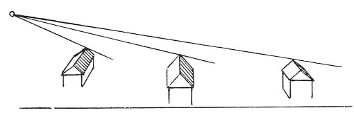

  
[Intangible Textual Heritage](../../index)  [Age of Reason](../index.md) 
[Index](index.md)   
[VIII. Botany for Painters and Elements of Landscape Painting
Index](dvs009.md)  
  [Previous](0464)  [Next](0466.md) 

------------------------------------------------------------------------

[Buy this Book at
Amazon.com](https://www.amazon.com/exec/obidos/ASIN/0486225720/internetsacredte.md)

------------------------------------------------------------------------

*The Da Vinci Notebooks at Intangible Textual Heritage*

### 465.

### OF LIGHT AND SHADOW IN A TOWN.

 On the treatment of light for views of towns
(465-469).

When the sun is in the East and the eye is above the centre of a town,
the eye will

p. 234

 

see the Southern part of the town with its roofs half in shade and half
in light, and the same towards the North; the Eastern side will be all
in shadow and the Western will be all in light.

------------------------------------------------------------------------

[Next: 466.](0466.md)
