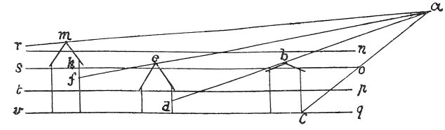

  
[Intangible Textual Heritage](../../index)  [Age of Reason](../index) 
[Index](index)   
[VIII. Botany for Painters and Elements of Landscape Painting
Index](dvs009)  
  [Previous](0465)  [Next](0467) 

------------------------------------------------------------------------

[Buy this Book at
Amazon.com](https://www.amazon.com/exec/obidos/ASIN/0486225720/internetsacredte)

------------------------------------------------------------------------

*The Da Vinci Notebooks at Intangible Textual Heritage*

### 466.

Of the houses of a town, in which the divisions between the houses may
be distinguished by the light which fall on the mist at the bottom. If
the eye is above the houses the light seen in the space that is between
one house and the next sinks by degrees into thicker mist; and yet,
being less transparent, it appears whiter; and if the houses are some
higher than the others, since the true \[colour\] is always more
discernible through the thinner atmosphere, the houses will look darker
in proportion as they are higher up. Let *n o p q* represent the various
density of the atmosphere thick with moisture, *a* being the eye,

 

the house *b c* will look lightest at the bottom, because it is in a
thicker atmosphere; the lines *c d f* will appear equally light, for
although *f* is more distant than *c*, it is raised into a thinner
atmosphere, if the houses *b e* are of the same height, because they
cross a brightness which is varied by mist, but this is only because the
line of the eye which starts from above ends by piercing a lower and
denser atmosphere at *d* than at *b*. Thus the line a *f* is lower at
*f* than at *c*; and the house *f* will be seen darker at *e* from the
line *e k* as far as *m*, than the tops of the houses standing in front
of it.

------------------------------------------------------------------------

[Next: 467.](0467)
