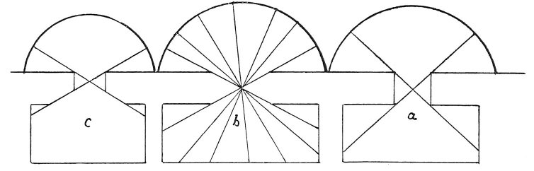

  
[Intangible Textual Heritage](../../index)  [Age of Reason](../index) 
[Index](index)   
[IX. The Practice of Painting Index](dvs010)  
  [Previous](0510)  [Next](0512) 

------------------------------------------------------------------------

[Buy this Book at
Amazon.com](https://www.amazon.com/exec/obidos/ASIN/0486225720/internetsacredte)

------------------------------------------------------------------------

*The Da Vinci Notebooks at Intangible Textual Heritage*

### 511.

The different kinds of light afforded in cellars by various forms of
windows. The

p. 256

least useful and the coldest is the window at *a*. The most useful, the
lightest and warmest

 

and most open to the sky is the window at *b*. The window at *c* is of
medium utility.

 [243](#fn_245)

------------------------------------------------------------------------

### Footnotes

[256:243](0511.htm#fr_245) : From a reference
to the notes on the right light for painting it becomes evident that the
observations made on cellar-windows have a direct bearing on the
construction of the studio-window. In the diagram *b* as well as in that
under No. 510 the window-opening is reduced to a minimum, but only, it
would seem, in order to emphasize the advantage of walls constructed on
the plan there shown.

------------------------------------------------------------------------

[Next: 512.](0512)
