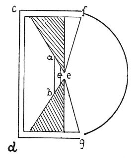

  
[Intangible Textual Heritage](../../index)  [Age of Reason](../index.md) 
[Index](index.md)   
[IX. The Practice of Painting Index](dvs010.md)  
  [Previous](0517)  [Next](0519.md) 

------------------------------------------------------------------------

[Buy this Book at
Amazon.com](https://www.amazon.com/exec/obidos/ASIN/0486225720/internetsacredte.md)

------------------------------------------------------------------------

*The Da Vinci Notebooks at Intangible Textual Heritage*

### 518.

p. 259

 

### OF THE QUALITY OF LIGHT.

In proportion to the number of times that *a b* goes into *c d* will it
be more luminous than *c d*. And similarly, in proportion as the point
*e* goes into *c d* will it be more luminous than *c d;* and this light
is useful for carvers of delicate work.  [246](#fn_248.md)

 [247](#fn_249.md)

------------------------------------------------------------------------

### Footnotes

[259:246](0518.htm#fr_248.md) 5: For the same
reason a window thus constructed would be convenient for an illuminator
or a miniature painter.

[259:247](0518.htm#fr_249.md) : M. RAVAISSON in
his edition of the Paris MS. A remarks on this passage: *"La figure
porte les lettres* f *et* g, *auxquelles rien ne renvoie dans
l'explication; par consequent, cette explication est incomplete. La
figure semblerait, d'ailleurs, se rapporter a l'effet de la reflexion
par un miroir concave."* So far as I can see the text is not imperfect,
nor is the sense obscure. It is hardly necessary to observe that *c d*
here indicate the wall of the room opposite to the window *e* and the
semicircle described by *f g* stands for the arch of the sky; this
occurs in various diagrams, for example under 511. A similar semicircle,
Pl III, No. 2 (and compare No. 149) is expressly called '*orizonte*' in
writing.

------------------------------------------------------------------------

[Next: 519.](0519.md)
