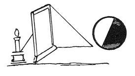

  
[Intangible Textual Heritage](../../index)  [Age of Reason](../index.md) 
[Index](index.md)   
[IX. The Practice of Painting Index](dvs010.md)  
  [Previous](0523)  [Next](0525.md) 

------------------------------------------------------------------------

[Buy this Book at
Amazon.com](https://www.amazon.com/exec/obidos/ASIN/0486225720/internetsacredte.md)

------------------------------------------------------------------------

*The Da Vinci Notebooks at Intangible Textual Heritage*

### 524.

p. 262

 

### A METHOD OF DRAWING AN OBJECT IN RELIEF AT NIGHT.

Place a sheet of not too transparent paper between the relievo and the
light and you can draw thus very well.

 [249](#fn_251.md)

------------------------------------------------------------------------

### Footnotes

[262:249](0524.htm#fr_251.md) : Bodies thus
illuminated will show on the surface of the paper how the copyist has to
distribute light and shade.

------------------------------------------------------------------------

[Next: 525.](0525.md)
