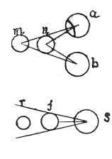

  
[Intangible Textual Heritage](../../index)  [Age of Reason](../index.md) 
[Index](index.md)   
[IX. The Practice of Painting Index](dvs010.md)  
  [Previous](0533)  [Next](0535.md) 

------------------------------------------------------------------------

[Buy this Book at
Amazon.com](https://www.amazon.com/exec/obidos/ASIN/0486225720/internetsacredte.md)

------------------------------------------------------------------------

*The Da Vinci Notebooks at Intangible Textual Heritage*

### 534.

### WHY A PAINTING CAN NEVER APPEAR DETACHED AS NATURAL OBJECTS DO.

Painters often fall into despair of imitating nature when they see their
pictures fail in that relief and vividness which objects have that are
seen in a mirror; while they allege that they have colours which for
brightness or depth far exceed the strength of light and shade in the
reflections in the mirror, thus displaying their own ignorance rather
than the real cause, because they do not know it. It is impossible that
painted objects should appear in such relief as to resemble those
reflected in the mirror, although both are seen on a flat surface,
unless they are seen

p. 268

 

with only one eye; and the reason is that two eyes see one object behind
another as *a* and *b* see *m* and *n*. *m* cannot exactly occupy \[the
space of\] *n* because the base of the visual lines is so broad that the
second body is seen beyond the first. But if you close one eye, as at
*s* the body *f* will conceal *r*, because the line of sight proceeds
from a single point and makes its base in the first body, whence the
second, of the same size, can never be seen.

 [255](#fn_257.md)

------------------------------------------------------------------------

### Footnotes

[268:255](0534.htm#fr_257.md) : This passage
contains the solution of the problem proposed in No. 29, lines 10-14.
Leonardo was evidently familiar with the law of optics on which the
construction of the stereoscope depends. Compare E. VON BRUCKE,
*Bruchstucke aus der Theorie der bildenden Kunste*, pg. 69: "*Schon
Leonardo da Vinci wusste, dass ein noch so gut gemaltes Bild nie den
vollen Eindruck der Korperlichkeit geben kann, wie ihn die Natur selbst
giebt. Er erklart dies auch in Kap. LIII und Kap. CCCXLI* (ed. DU
FRESNE) *des* 'Trattato' *in sachgemasser Weise aus dem Sehen mit beiden
Augen*."

Chap. 53 of DU FRESNE'S edition corresponds to No. 534 of this work.

------------------------------------------------------------------------

[Next: 535.](0535.md)
