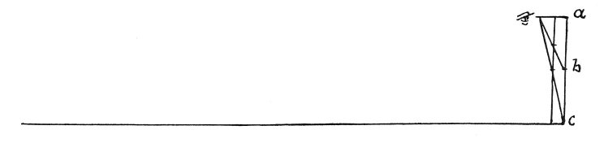

  
[Intangible Textual Heritage](../../index)  [Age of Reason](../index) 
[Index](index)   
[IX. The Practice of Painting Index](dvs010)  
  [Previous](0545)  [Next](0547) 

------------------------------------------------------------------------

[Buy this Book at
Amazon.com](https://www.amazon.com/exec/obidos/ASIN/0486225720/internetsacredte)

------------------------------------------------------------------------

*The Da Vinci Notebooks at Intangible Textual Heritage*

### 546.

### OF PAINTING.

 

The size of the figures represented ought to show you the distance they
are seen from. If you see a figure as large as nature you know it
appears to be close to the eye.

------------------------------------------------------------------------

[Next: 547.](0547)
