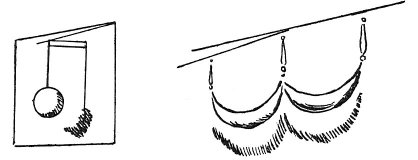

  
[Intangible Textual Heritage](../../index)  [Age of Reason](../index.md) 
[Index](index.md)   
[IX. The Practice of Painting Index](dvs010.md)  
  [Previous](0564)  [Next](0566.md) 

------------------------------------------------------------------------

[Buy this Book at
Amazon.com](https://www.amazon.com/exec/obidos/ASIN/0486225720/internetsacredte.md)

------------------------------------------------------------------------

*The Da Vinci Notebooks at Intangible Textual Heritage*

### 565.

 

That you ought, when representing objects above the eye and on one
side--if you wish them to look detached from the wall--to show, between
the shadow on the object and the shadow it casts a middle light, so that
the body will appear to stand away from the wall.

------------------------------------------------------------------------

[Next: 566.](0566.md)
