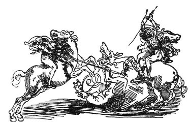

  
[Intangible Textual Heritage](../../index)  [Age of Reason](../index) 
[Index](index)   
[IX. The Practice of Painting Index](dvs010)  
  [Previous](0584)  [Next](0586) 

------------------------------------------------------------------------

[Buy this Book at
Amazon.com](https://www.amazon.com/exec/obidos/ASIN/0486225720/internetsacredte)

------------------------------------------------------------------------

*The Da Vinci Notebooks at Intangible Textual Heritage*

### 585.

### HOW YOU SHOULD MAKE AN IMAGINARY ANIMAL LOOK NATURAL.

!mOf representing imaginary animals. You know that you cannot invent
animals without limbs, each of which, in itself, must resemble those of
some other animal. Hence if you wish to make an animal, imagined by you,
appear natural--let us say a Dragon, take for its head that of a mastiff
or hound, with

p. 293

the eyes of a cat, the ears of a porcupine, the nose of a greyhound, the
brow of a lion, the

 

temples of an old cock, the neck of a water tortoise.

 [272](#fn_274)

------------------------------------------------------------------------

### Footnotes

[293:272](0585.htm#fr_274) : The sketch here
inserted of two men on horseback fighting a dragon is the facsimile of a
pen and ink drawing belonging to BARON EDMOND DE ROTHSCHILD of Paris.

------------------------------------------------------------------------

[Next: 586.](0586)
