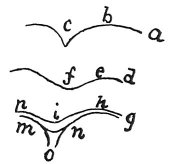

  
[Intangible Textual Heritage](../../index)  [Age of Reason](../index.md) 
[Index](index.md)   
[IX. The Practice of Painting Index](dvs010.md)  
  [Previous](0589)  [Next](0591.md) 

------------------------------------------------------------------------

[Buy this Book at
Amazon.com](https://www.amazon.com/exec/obidos/ASIN/0486225720/internetsacredte.md)

------------------------------------------------------------------------

*The Da Vinci Notebooks at Intangible Textual Heritage*

### 590.

### OF THE MUSCLES OF ANIMALS.

 

The hollow spaces interposed between the muscles must not be of such a
character as that the skin should seem to cover two sticks laid side by
side like *c*, nor should they seem like two sticks somewhat remote from
such contact so that the skin hangs in an empty loose curve as at *f*;
but it should be like *i*, laid over the spongy fat that lies in the
angles as the angle *n m o*; which angle is formed by the contact of the
ends of the muscles and as the skin cannot fold down into such an angle,
nature has filled up such angles with a small quantity of spongy and, as
I may say, vesicular fat, with minute bladders \[in it\] full of air,
which is condensed or rarefied in them according to the increase or the
diminution of the substance of the muscles; in which latter case the
concavity *i* always has a larger curve than the muscle.

------------------------------------------------------------------------

[Next: 591.](0591.md)
