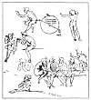

  
[Intangible Textual Heritage](../../index)  [Age of Reason](../index) 
[Index](index)   
[IX. The Practice of Painting Index](dvs010)  
  [Previous](0593)  [Next](0595) 

------------------------------------------------------------------------

[Buy this Book at
Amazon.com](https://www.amazon.com/exec/obidos/ASIN/0486225720/internetsacredte)

------------------------------------------------------------------------

*The Da Vinci Notebooks at Intangible Textual Heritage*

### 594.

### OF REPRESENTING A MAN SPEAKING TO A MULTITUDE.

When you wish to represent a man speaking to a number of people,
consider the matter of which he has to treat and adapt

p. 297

his action to the subject. Thus, if he speaks persuasively, let his
action be appropriate to it. If the matter in hand be to set forth an
argument, let the speaker, with the fingers of the right hand hold one
finger of the left hand, having the two smaller ones closed; and

[  
Click to enlarge](img/v129700.jpg)

his face alert, and turned towards the people with mouth a little open,
to look as though he spoke; and if he is sitting let him appear as
though about to rise, with his head forward. If you represent him
standing make him leaning slightly forward with body and

p. 298

head towards the people. These you must represent as silent and
attentive, all looking at the orator's face with gestures of admiration;
and make some old men in astonishment at the things they hear, with the
corners of their mouths pulled down and drawn in, their cheeks full of
furrows, and their eyebrows raised, and wrinkling the forehead where
they meet. Again, some sitting with their fingers clasped holding their
weary knees. Again, some bent old man, with one knee crossed over the
other; on which let him hold his hand with his other elbow resting in it
and the hand supporting his bearded chin.

 [274](#fn_276)

------------------------------------------------------------------------

### Footnotes

[298:274](0594.htm#fr_276) : The sketches
introduced here are a facsimile of a pen and ink drawing in the Louvre
which Herr CARL BRUN considers as studies for the Last Supper in the
church of *Santa Maria delle Grazie* (see Leonardo da Vinci, LXI, pp.
21, 27 and 28 in DOHME'S *Kunst und Kunstler*, Leipzig, Seemann). I
shall not here enter into any discussion of this suggestion; but as a
justification for introducing the drawing in this place, I may point out
that some of the figures illustrate this passage as perfectly as though
they had been drawn for that express purpose. I have discussed the
probability of a connection between this sketch and the picture of the
Last Supper on p. 335. The original drawing is 27 3/4 centimetres wide
by 21 high.--The drawing in silver point on reddish paper given on [Pl.
LII](pl052.htm#img_pl052). No. 1--the original at Windsor Castle--may
also serve to illustrate the subject of appropriate gestures, treated in
Nos. 593 and 594.

------------------------------------------------------------------------

[Next: 595.](0595)
