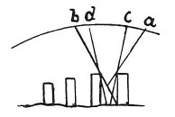

  
[Intangible Textual Heritage](../../index)  [Age of Reason](../index.md) 
[Index](index.md)   
[IX. The Practice of Painting Index](dvs010.md)  
  [Previous](0602)  [Next](0604.md) 

------------------------------------------------------------------------

[Buy this Book at
Amazon.com](https://www.amazon.com/exec/obidos/ASIN/0486225720/internetsacredte.md)

------------------------------------------------------------------------

*The Da Vinci Notebooks at Intangible Textual Heritage*

### 603.

p. 304

 

### OF LIGHTING THE LOWER PARTS OF BODIES CLOSE TOGETHER, AS OF MEN IN BATTLE.

As to men and horses represented in battle, their different parts will
be dark in proportion as they are nearer to the ground on which they
stand. And this is proved by the sides of wells which grow darker in
proportion to their depth, the reason of which is that the deepest part
of the well sees and receives a smaller amount of the luminous
atmosphere than any other part.

And the pavement, if it be of the same colour as the legs of these said
men and horses, will always be more lighted and at a more direct angle
than the said legs &c

------------------------------------------------------------------------

[Next: 604.](0604.md)
