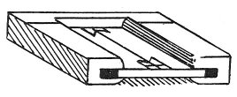

  
[Intangible Textual Heritage](../../index)  [Age of Reason](../index.md) 
[Index](index.md)   
[IX. The Practice of Painting Index](dvs010.md)  
  [Previous](0627)  [Next](0629.md) 

------------------------------------------------------------------------

[Buy this Book at
Amazon.com](https://www.amazon.com/exec/obidos/ASIN/0486225720/internetsacredte.md)

------------------------------------------------------------------------

*The Da Vinci Notebooks at Intangible Textual Heritage*

### 628.

 

### TO PREPARE A PANEL FOR PAINTING ON.

 Of preparing the panel.The panel should
be cypress or pear or service-tree or walnut. You must coat it over with
mastic and turpentine twice distilled and white or, if you like, lime,
and put it in a frame so that it may expand and shrink according to its
moisture and dryness. Then give it \[a coat\] of aqua vitae in which you
have dissolved arsenic or \[corrosive\] sublimate, 2 or 3 times. Then
apply boiled linseed oil in such a way as that it may penetrate every
part, and before it is cold rub it well with a cloth to dry it. Over
this apply liquid varnish and white with a stick, then wash it with
urine when it is dry, and dry it again. Then pounce and outline your
drawing finely and over it lay a priming of 30 parts of verdigris with
one of verdigris with two of yellow.

 [292](#fn_294.md)

------------------------------------------------------------------------

### Footnotes

[319:292](0628.htm#fr_294.md) : M. RAVAISSON'S
reading varies from mine in the following passages:

1.*opero allor \[?\] bo \[alloro?\]* = "*ou bien de \[laurier\]*."

6\. *fregalo bene con un panno*. He reads *pane* for *panno* and renders
it. "*Frotte le bien avec un pain de facon \[jusqu'a ce\] qu'il*" etc.

7\. *colla stecca po laua*. He reads "*polacca*" = "*avec le couteau de
bois \[?\] polonais \[?\]*."

------------------------------------------------------------------------

[Next: 629.](0629.md)
