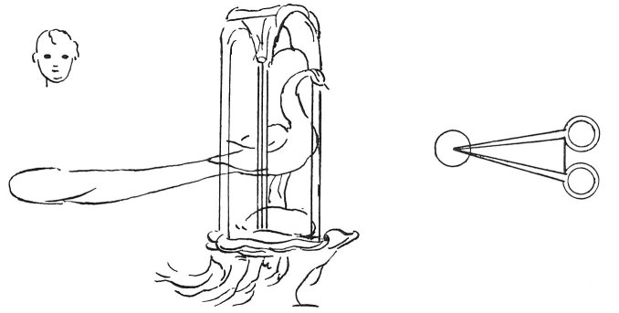
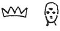
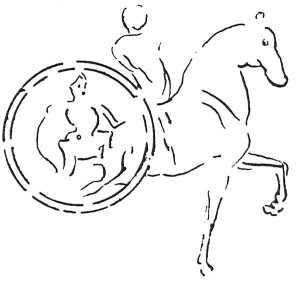

  
[Intangible Textual Heritage](../../index)  [Age of Reason](../index.md) 
[Index](index.md)   
[X. Studies and Sketches for Pictures and Decorations Index](dvs011.md)  
  [Previous](0673)  [Next](0675.md) 

------------------------------------------------------------------------

[Buy this Book at
Amazon.com](https://www.amazon.com/exec/obidos/ASIN/0486225720/internetsacredte.md)

------------------------------------------------------------------------

*The Da Vinci Notebooks at Intangible Textual Heritage*

### 674.

p. 351

 Allegorical representations
(674--678).Above the helmet place a half globe, which is to
signify our hemisphere, in the form of a world; on which let there be a
peacock, richly decorated, and with his tail spread over the group; and
every ornament belonging to the horse should be of peacock's feathers on
a gold ground, to signify the beauty which comes of the grace bestowed
on him who is a good servant.

 

On the shield a large mirror to signify that he who truly desires favour
must be mirrored in his virtues.

 

On the opposite side will be represented Fortitude, in like manner in
her place with her pillar in her hand, robed in white, to signify ...
And all crowned; and Prudence with 3 eyes. The housing of the horse
should be of plain cloth of gold closely sprinkled with peacock's eyes,
and this holds good for all the housings of the horse, and the man's
dress. And the man's crest and his neck-chain are of peacock's feathers
on golden ground.

 

On the left side will be a wheel, the centre of which should be attached
to the centre of the horse's hinder thigh piece, and in the centre
Prudence is seen robed in red, Charity sitting in a

p. 352

fiery chariot and with a branch of laurel in her hand, to signify the
hope which comes of good service.

\[21\] Messer Antonio Grimani of Venice companion of Antonio Maria
\[23\].

 [309](#fn_311.md)

------------------------------------------------------------------------

### Footnotes

[352:309](0674.htm#fr_311.md) : *Messer Antonio
Gri*. His name thus abbreviated is, there can be no doubt, Grimani.
Antonio Grimani was the famous Doge who in 1499 commanded the Venetian
fleet in battle against the Turks. But after the abortive conclusion of
the expedition--Ludovico being the ally of the Turks who took possession
of Friuli--, Grimani was driven into exile; he went to live at Rome with
his son Cardinal Domenico Grimani. On being recalled to Venice he filled
the office of Doge from 1521 to 1523. *Antonio Maria* probably means
Antonio Maria Grimani, the Patriarch of Aquileia.

------------------------------------------------------------------------

[Next: 675.](0675.md)
