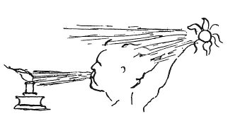

  
[Intangible Textual Heritage](../../index)  [Age of Reason](../index.md) 
[Index](index.md)   
[X. Studies and Sketches for Pictures and Decorations Index](dvs011.md)  
  [Previous](0686)  [Next](0688.md) 

------------------------------------------------------------------------

[Buy this Book at
Amazon.com](https://www.amazon.com/exec/obidos/ASIN/0486225720/internetsacredte.md)

------------------------------------------------------------------------

*The Da Vinci Notebooks at Intangible Textual Heritage*

### 687.

p. 358

 

### TO REPRESENT INGRATITUDE.

  When the sun appears  
  which dispels darkness in  
  general, you put out the  
  light which dispelled it  
  for you in particular  
  for your need and convenience.  

------------------------------------------------------------------------

[Next: 688.](0688.md)
