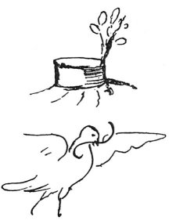

  
[Intangible Textual Heritage](../../index)  [Age of Reason](../index) 
[Index](index)   
[X. Studies and Sketches for Pictures and Decorations Index](dvs011)  
  [Previous](0696)  [Next](0698) 

------------------------------------------------------------------------

[Buy this Book at
Amazon.com](https://www.amazon.com/exec/obidos/ASIN/0486225720/internetsacredte)

------------------------------------------------------------------------

*The Da Vinci Notebooks at Intangible Textual Heritage*

### 697.

p. 360

 

  A felled tree which is shooting  
      again.  

    30  
    40  
  ------  
  1200

  I am still hopeful.  
      A falcon,  
      Time.  

 [326](#fn_328)

------------------------------------------------------------------------

### Footnotes

[360:326](0697.htm#fr_328) : I. *Albero
tagliato*. This emblem was displayed during the Carnival at Florence in
1513. See VASARI VI, 251, ed. MILANESI 1881. But the coincidence is
probably accidental.

------------------------------------------------------------------------

[Next: 698.](0698)
