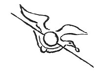

  
[Intangible Textual Heritage](../../index)  [Age of Reason](../index) 
[Index](index)   
[X. Studies and Sketches for Pictures and Decorations Index](dvs011)  
  [Previous](0702)  [Next](0704) 

------------------------------------------------------------------------

[Buy this Book at
Amazon.com](https://www.amazon.com/exec/obidos/ASIN/0486225720/internetsacredte)

------------------------------------------------------------------------

*The Da Vinci Notebooks at Intangible Textual Heritage*

### 703.

p. 361

 

A bird, for a comedy.

 [331](#fn_333)

------------------------------------------------------------------------

### Footnotes

[361:331](0703.htm#fr_333) : The biographies
say so much, and the author's notes say so little of the invention
attributed to Leonardo of making artificial birds fly through the air,
that the text here given is of exceptional interest from being
accompanied by a sketch. It is a very slight drawing of a bird with
outspread wings, which appears to be sliding down a stretched string.
Leonardo's flying machines and his studies of the flight of birds will
be referred to later.

------------------------------------------------------------------------

[Next: 704.](0704)
