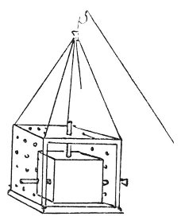

  
[Intangible Textual Heritage](../../index)  [Age of Reason](../index.md) 
[Index](index.md)   
[XI. The Notes on Sculpture Index](dvs013.md)  
  [Previous](dv20003)  [Next](0707.md) 

------------------------------------------------------------------------

[Buy this Book at
Amazon.com](https://www.amazon.com/exec/obidos/ASIN/0486225739/internetsacredte.md)

------------------------------------------------------------------------

*The Da Vinci Notebooks at Intangible Textual Heritage*

### 706.

p. 9

### OF A STATUE.

 

 Some practical hints (706-709).If you
wish to make a figure in marble, first make one of clay, and when you
have finished it, let it dry and place it in a case which should be
large enough, after the figure is taken out of it, to receive also the
marble, from which you intend to reveal the figure in imitation of the
one in clay. After you have put the clay figure into this said case,
have little rods which will exactly slip in to the holes in it, and
thrust them so far in at each hole that each white rod may touch the
figure in different parts of it. And colour the portion of the rod that
remains outside black, and mark each rod and each hole with a
countersign so that each may fit into its place. Then take the clay
figure out of this case and put in your piece of marble, taking off so
much of the marble that all your rods may be hidden in the holes as far
as their marks; and to be the better able to do this, make the case so
that it can be lifted up; but the bottom of it will always remain under
the marble and in this way it can be lifted with tools with great ease.

------------------------------------------------------------------------

[Next: 707.](0707.md)
