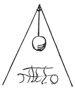

  
[Intangible Textual Heritage](../../index)  [Age of Reason](../index) 
[Index](index)   
[XI. The Notes on Sculpture Index](dvs013)  
  [Previous](0737)  [Next](0739) 

------------------------------------------------------------------------

[Buy this Book at
Amazon.com](https://www.amazon.com/exec/obidos/ASIN/0486225739/internetsacredte)

------------------------------------------------------------------------

*The Da Vinci Notebooks at Intangible Textual Heritage*

### 738.

### HOW TO PROCEED TO BREAK A LARGE MASS OF BRONZE.

 

If you want to break up a large mass of bronze, first suspend it, and
then make round it a wall on the four sides, like a trough of bricks,
and make a great fire therein. When it is quite red hot give it a blow
with a heavy weight raised above it, and with great force.

------------------------------------------------------------------------

[Next: 739.](0739)
