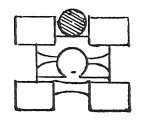
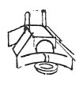

  
[Intangible Textual Heritage](../../index)  [Age of Reason](../index) 
[Index](index)   
[XI. The Notes on Sculpture Index](dvs013)  
  [Previous](0738)  [Next](0740) 

------------------------------------------------------------------------

[Buy this Book at
Amazon.com](https://www.amazon.com/exec/obidos/ASIN/0486225739/internetsacredte)

------------------------------------------------------------------------

*The Da Vinci Notebooks at Intangible Textual Heritage*

### 739.

### TO COMBINE LEAD WITH OTHER METAL.

If you wish for economy in combining lead with the metal in order to
lessen the amount of tin which is necessary in the metal, first alloy
the lead with the tin and then add the molten copper.

### HOW TO MELT \[METAL\] IN A FURNACE.

 

The furnace should be between four well founded pillars.

### OF THE THICKNESS OF THE COATING.

 

The coating should not be more than two fingers thick, it should be laid
on in four thicknesses over fine clay and then well fixed, and it should
be fired only on the inside and then carefully covered with ashes and
cow's dung.

### OF THE THICKNESS OF THE GUN.

The gun being made to carry 600 Ibs. of ball and more, by this rule you
will take the measure of the diameter of the ball and

p. 23

divide it into 6 parts and one of these parts will be its thickness at
the muzzle; but at the breech it must always be half. And if the ball is
to be 700 lbs., 1/7th of the diameter of the ball must be its thickness
in front; and if the ball is to be 800, the eighth of its diameter in
front; and if 900, 1/8th and 1/2 \[3/16\], and if 1000, 1/9th.

### OF THE LENGTH OF THE BODY OF THE GUN.

If you want it to throw a ball of stone, make the length of the gun to
be 6, or as much as 7 diameters of the ball; and if the ball is to be of
iron make it as much as 12 balls, and if the ball is to be of lead, make
it as much as 18 balls. I mean when the gun is to have the mouth fitted
to receive 600 lbs. of stone ball, and more.

### OF THE THICKNESS OF SMALL GUNS.

The thickness at the muzzle of small guns should be from a half to one
third of the diameter of the ball, and the length from 30 to 36 balls.

------------------------------------------------------------------------

[Next: 740.](0740)
