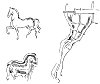

  
[Intangible Textual Heritage](../../index)  [Age of Reason](../index.md) 
[Index](index.md)   
[XI. The Notes on Sculpture Index](dvs013.md)  
  [Previous](0739)  [Next](dv20038.md) 

------------------------------------------------------------------------

[Buy this Book at
Amazon.com](https://www.amazon.com/exec/obidos/ASIN/0486225739/internetsacredte.md)

------------------------------------------------------------------------

*The Da Vinci Notebooks at Intangible Textual Heritage*

### 740.

### OF LUTING THE FURNACE WITHIN.

The furnace must be luted before you put the metal in it, with earth
from Valenza, and over that with ashes.

 [354](#fn_20.md)

### OF RESTORING THE METAL WHEN IT IS BECOMING COOL.

When you see that the bronze is congealing take some willow-wood cut in
small chips and make up the fire with it.

### THE CAUSE OF ITS CURDLING.

I say that the cause of this congealing often proceeds from too much
fire, or from ill-dried wood.

### TO KNOW THE CONDITION OF THE FIRE.

You may know when the fire is good and fit for your purpose by a clear
flame,

p. 24

and if you see the tips of the flames dull and ending in much smoke do
not trust it, and particularly when the flux metal is almost fluid.

### OF ALLOYING THE METAL.

Metal for guns must invariably be made with 6 or even 8 per cent, that
is 6 of tin to one hundred of copper, for the less you put in, the
stronger will the gun be.

### WHEN THE TIN SHOULD BE ADDED TO THE COPPER.

The tin should be put in with the copper when the copper is reduced to a
fluid.

### HOW TO HASTEN THE MELTING.

You can hasten the melting when 2/3ds of the copper is fluid; you can
then, with a stick of chestnut-wood, repeatedly stir what of copper
remains entire amidst what is melted.

[  
Click to enlarge](img/v202400.jpg.md)

------------------------------------------------------------------------

### Footnotes

[23:354](0740.htm#fr_20.md) 1. 2.: *Terra di
Valenza*.--Valenza is north of Alessandria on the Po.

------------------------------------------------------------------------

[Next: Introduction](dv20038.md)
