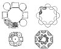

  
[Intangible Textual Heritage](../../index)  [Age of Reason](../index) 
[Index](index)   
[XII. Architectural Designs Index](dvs014)  
  [Previous](0743)  [Next](dv20044) 

------------------------------------------------------------------------

[Buy this Book at
Amazon.com](https://www.amazon.com/exec/obidos/ASIN/0486225739/internetsacredte)

------------------------------------------------------------------------

*The Da Vinci Notebooks at Intangible Textual Heritage*

### 744.

### ON MOVING HOUSES.

Let the houses be moved and arranged in order; and this will be done
with facility

p. 29

because such houses are at first made in pieces on the open places, and
can then be fitted together with their timbers in the site where they
are to be permanent.

[  
Click to enlarge](img/v202900.jpg)

\[9\] Let the men of the country \[or the village\] partly inhabit the
new houses when the court is absent \[12\].

 [355](#fn_21)

------------------------------------------------------------------------

### Footnotes

[29:355](0744.htm#fr_21) : On the same page we
find notes referring to Romolontino and Villafranca with a sketch-map of
the course of the "Sodro" and the "(Lo)cra" (both are given in the text
farther on). There can hardly be a doubt that the last sentence of the
passage given above, refers to the court of Francis I. King of
France.--L.9-13 are written inside the larger sketch, which, in the
original, is on the right hand side of the page by the side of lines
1-8. The three smaller sketches are below. J. P. R.

------------------------------------------------------------------------

[Next: II. Plans for Canals and streets in a town.](dv20044)
