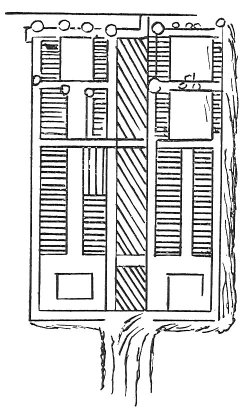

  
[Intangible Textual Heritage](../../index)  [Age of Reason](../index.md) 
[Index](index.md)   
[XII. Architectural Designs Index](dvs014.md)  
  [Previous](0746)  [Next](dv20048.md) 

------------------------------------------------------------------------

[Buy this Book at
Amazon.com](https://www.amazon.com/exec/obidos/ASIN/0486225739/internetsacredte.md)

------------------------------------------------------------------------

*The Da Vinci Notebooks at Intangible Textual Heritage*

### 747.

 

The main underground channel does not receive turbid water, but that
water runs in the ditches outside the town with four mills at the
entrance and four at the outlet; and this may be done by damming the
water above Romorantin.

\[11\]There should be fountains made in each piazza\[13\].

 [358](#fn_24.md)

 [359](#fn_25.md)

------------------------------------------------------------------------

### Footnotes

[31:358](0747.htm#fr_24.md) : In the original this
text comes immediately after the passage given as No. 744. The remainder
of the writing on the same page refers to the construction of canals and
is given later, in the "Topographical Notes".

Lines 1-11 are written to the right of the plan lines 11-13 underneath
it. J. P. R.

[31:359](0747.htm#fr_25.md) 10: *Romolontino* is
Romorantin, South of Orleans in France.

------------------------------------------------------------------------

[Next: III. Castles and Villas.](dv20048.md)
