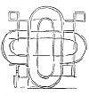

  
[Intangible Textual Heritage](../../index)  [Age of Reason](../index.md) 
[Index](index.md)   
[XII. Architectural Designs Index](dvs014.md)  
  [Previous](dv20058)  [Next](dv20060.md) 

------------------------------------------------------------------------

[Buy this Book at
Amazon.com](https://www.amazon.com/exec/obidos/ASIN/0486225739/internetsacredte.md)

------------------------------------------------------------------------

*The Da Vinci Notebooks at Intangible Textual Heritage*

### 756.

This edifice is inhabited \[accessible\] below and above, like San
Sepolcro, and it is the same above as below, except that the upper story
has the dome *c d*; and the  [376](#fn_42.md)

p. 51

lower has the dome *a b*, and when you enter into the crypt, you descend
10 steps, and when you mount into the upper you ascend 20 steps, which,
with 1/3 braccio for each, make 10 braccia, and this is the height
between one floor of the church and the other.

*Above the plan on the same sheet is a view of the exterior. By the aid
of these two figures and the description, sections of the edifice may
easily be reconstructed. But the section drawn on the left side of the
building seems not to be in keeping with the same plan, notwithstanding
the explanatory note written underneath it:* "dentro il difitio di
sopra" *(interior of the edifice above)* [377](#fn_43.md) .

*Before leaving this group, it is well to remark that the germ of it
seems already indicated by the diagonal lines in the plans [Pl.
LXXXV](pl085.htm#img_pl085.md) No. 11 and No. 7. We shall find another
application of the same type to the Latin cross in [Pl.
XCVII](pl097.htm#img_pl097.md) No. 3.*

[  
Click to enlarge](img/v205100.jpg.md)

------------------------------------------------------------------------

### Footnotes

[50:376](0756.htm#fr_42.md) : The church of San
Sepolcro at Milan, founded in 1030 and repeatedly rebuilt after the
middle of the XVIth century, still stands over the crypt of the original
structure.

[51:377](0756.htm#fr_43.md) 1: *The small inner
dome corresponds to* a b *on the plan--it rises from the lower church
into the upper-- above, and larger, rises the dome* c d. *The aisles
above and below thus correspond* (e di sopra come di sotto, salvoche
etc.). *The only difference is, that in the section Leonardo has not
taken the trouble to make the form octagonal, but has merely sketched
circular lines in perspective.* J. P. R.

------------------------------------------------------------------------

[Next: 2. Churches formed on the plan of a Latin cross.](dv20060.md)
