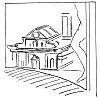

  
[Intangible Textual Heritage](../../index)  [Age of Reason](../index) 
[Index](index)   
[XII. Architectural Designs Index](dvs014)  
  [Previous](dv20060)  [Next](dv20062) 

------------------------------------------------------------------------

[Buy this Book at
Amazon.com](https://www.amazon.com/exec/obidos/ASIN/0486225739/internetsacredte)

------------------------------------------------------------------------

*The Da Vinci Notebooks at Intangible Textual Heritage*

### 757.

This building is inhabited below and above; the way up is by the
campaniles, and in going up one has to use the platform, where the drums
of the four domes are, and this platform has a parapet in front, and
none of these domes communicate with the church, but they are quite
separate.

*[Pl. XCVI](pl096.htm#img_pl096) No. 1 (MS. C. A. 16b; 65a). Perspective
view of a church seen from behind; this recalls the Duomo at Florence,
but with two campaniles* [379](#fn_45) .

*[Pl. XCVII](pl097.htm#img_pl097) No. 3 (MS. B. 52a). The central part
is a development of S. Lorenzo at Milan, such as was executed at the
Duomo of Pavia. There is sufficient analogy between the building
actually executed and this sketch to suggest a direct connection between
them. Leonardo accompanied Francesco di Giorgio* [380](#fn_46) *when the latter was consulted on June
21st, 1490 as to this church; the fact that the only word accompanying
the plan is:* "sagrestia", *seems to confirm our supposition, for the
sacristies were added only in 1492, i. e. four years after the beginning
of the Cathedral, which at that time was most likely still sufficiently
unfinished to be capable of receiving the form of the present sketch.*

[Pl. XCVII](pl097.htm#img_pl097) No. 2 shows the exterior of this
design. Below is the note: edifitio al proposito del fodameto figurato
di socto *(edifice proper for the ground plan figured below).*

Here we may also mention the plan of a Latin cross drawn in MS. C. A.
fol. 266 (see p. 50).

[Pl. XCIV](pl094.htm#img_pl094) No. 1 (MS. L. 15b). External side view
of Brunellesco's Florentine basilica San Lorenzo, seen from the North.

[Pl. XCIV](pl094.htm#img_pl094) No. 4 (V. A. V, 1). Principal front of a
nave, most likely of a church on the plan of a Latin cross. We notice
here not only the

p. 54

*principal features which were employed afterwards in Alberti's front of
S. Maria Novella, but even details of a more advanced style, such as we
are accustomed to meet with only after the year 1520.*

In the background of Leonardo's unfinished picture of St. Jerome
(Vatican Gallery) a somewhat similar church front is indicated (see the
accompanying sketch).

[  
Click to enlarge](img/v205400.jpg)

*The view of the front of a temple, apparently a dome in the centre of
four corinthian porticos bearing pediments (published by Amoretti Tav.
II. B as being by Leonardo), is taken from a drawing, now at the
Ambrosian Gallery. We cannot consider this to be by the hand of the
master.*

------------------------------------------------------------------------

### Footnotes

[53:379](0757.htm#fr_45) 2: *Already published
in the* Saggio [Pl. IX](dv20947.htm#img_pl009).

[53:380](0757.htm#fr_46) 3: See MALASPINA, il
Duomo di Pavia. *Documents*.

------------------------------------------------------------------------

[Next: C. Studies for a form of a Church most proper for
preaching.](dv20062)
