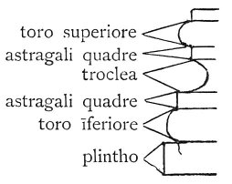

  
[Intangible Textual Heritage](../../index)  [Age of Reason](../index) 
[Index](index)   
[XII. Architectural Designs Index](dvs014)  
  [Previous](dv20072)  [Next](0765) 

------------------------------------------------------------------------

[Buy this Book at
Amazon.com](https://www.amazon.com/exec/obidos/ASIN/0486225739/internetsacredte)

------------------------------------------------------------------------

*The Da Vinci Notebooks at Intangible Textual Heritage*

### 764.

p. 72

 

 [393](#fn_59)

------------------------------------------------------------------------

### Footnotes

[72:393](0764.htm#fr_59) : No explanation can be
offered of the meaning of the letter B, which precedes each name. It may
be meant for *basa* (base). Perhaps it refers to some author on
architecture or an architect (Bramante?) who employed the designations,
thus marked for the mouldings. 3. *troclea.* Philander: *Trochlea sive
trochalia aut rechanum.* 6. *Laterculus* or *latastrum* is the Latin
name for *Plinthus* (pi lambda Xiv) but Vitruvius adopted this Greek
name and "latastro" seems to have been little in use. It is to be found
besides the text given above, as far as I am aware, only two drawings of
the Uffizi Collection, where in one instance, it indicates the *abacus*
of a Doric capital.

------------------------------------------------------------------------

[Next: 765.](0765)
