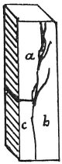

  
[Intangible Textual Heritage](../../index)  [Age of Reason](../index.md) 
[Index](index.md)   
[XIII. Theoretical Writings on Architecture Index](dvs015.md)  
  [Previous](0772)  [Next](0774.md) 

------------------------------------------------------------------------

[Buy this Book at
Amazon.com](https://www.amazon.com/exec/obidos/ASIN/0486225739/internetsacredte.md)

------------------------------------------------------------------------

*The Da Vinci Notebooks at Intangible Textual Heritage*

### 773.

p. 80

 

### OF THE CAUSES OF FISSURES IN \[THE WALLS OF\] PUBLIC AND PRIVATE BUILDINGS.

The walls give way in cracks, some of which are more or less vertical
and others are oblique. The cracks which are in a vertical direction are
caused by the joining of new walls, with old walls, whether straight or
with indentations fitting on to those of the old wall; for, as these
indentations cannot bear the too great weight of the wall added on to
them, it is inevitable that they should break, and give way to the
settling of the new wall, which will shrink one braccia in every ten,
more or less, according to the greater or smaller quantity of mortar
used between the stones of the masonry, and whether this mortar is more
or less liquid. And observe, that the walls should always be built first
and then faced with the stones intended to face them. For, if you do not
proceed thus, since the wall settles more than the stone facing, the
projections left on the sides of the wall must inevitably give way;
because the stones used for facing the wall being larger than those over
which they are laid, they will necessarily have less mortar laid between
the joints, and consequently they settle less; and this cannot happen if
the facing is added after the wall is dry.

*a b* the new wall, *c* the old wall, which has already settled; and the
part *a b* settles afterwards, although *a*, being founded on *c*, the
old wall, cannot possibly break, having a stable foundation on the old
wall. But only the remainder *b* of the new wall will break away,
because it is built from top to bottom of the building; and the
remainder of the new wall will overhang the gap above the wall that has
sunk.

------------------------------------------------------------------------

[Next: 774.](0774.md)
