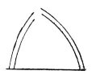
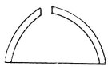
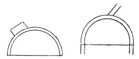
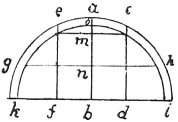
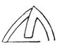

  
[Intangible Textual Heritage](../../index)  [Age of Reason](../index.md) 
[Index](index.md)   
[XIII. Theoretical Writings on Architecture Index](dvs015.md)  
  [Previous](0778)  [Next](0780.md) 

------------------------------------------------------------------------

[Buy this Book at
Amazon.com](https://www.amazon.com/exec/obidos/ASIN/0486225739/internetsacredte.md)

------------------------------------------------------------------------

*The Da Vinci Notebooks at Intangible Textual Heritage*

### 779.

p. 86

### III.

### ON THE NATURE OF THE ARCH.

### WHAT IS AN ARCH?

 

The arch is nothing else than a force originated by two weaknesses, for
the arch in buildings is composed of two segments of a circle, each of
which being very weak in itself tends to fall; but as each opposes this
tendency in the other, the two weaknesses combine to form one strength.

### OF THE KIND OF PRESSURE IN ARCHES.

 

As the arch is a composite force it remains in equilibrium because the
thrust is equal from both sides; and if one of the segments weighs more
than the other the stability is lost, because the greater pressure will
outweigh the lesser.

### OF DISTRIBUTING THE PRESSURE ABOVE AN ARCH.

 

Next to giving the segments of the circle equal weight it is necessary
to load them equally, or you will fall into the same defect as before.

p. 87

### WHERE AN ARCH BREAKS.

 

An arch breaks at the part which lies below half way from the centre.

### SECOND RUPTURE OF THE ARCH.

 

If the excess of weight be placed in the middle of the arch at the point
*a*, that weight tends to fall towards *b*, and the arch breaks at 2/3
of its height at *c e*; and *g e* is as many times stronger than *e a*,
as *m o* goes into *m n*.

### ON ANOTHER CAUSE OF RUIN.

 

The arch will likewise give way under a transversal thrust, for when the
charge is not thrown directly on the foot of the arch, the arch lasts
but a short time.

------------------------------------------------------------------------

[Next: 780.](0780.md)
