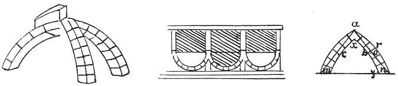

  
[Intangible Textual Heritage](../../index)  [Age of Reason](../index) 
[Index](index)   
[XIII. Theoretical Writings on Architecture Index](dvs015)  
  [Previous](0780)  [Next](0782) 

------------------------------------------------------------------------

[Buy this Book at
Amazon.com](https://www.amazon.com/exec/obidos/ASIN/0486225739/internetsacredte)

------------------------------------------------------------------------

*The Da Vinci Notebooks at Intangible Textual Heritage*

### 781.

### ON THE REMEDY FOR EARTHQUAKES.

 

The arch which throws its pressure perpendicularly on the abutments will
fulfil its function whatever be its direction, upside down, sideways or
upright.

The arch will not break if the chord of the outer arch does not touch
the inner arch. This is manifest by experience, because whenever the
chord *a o n* of the outer arch *n r a* approaches the inner arch *x b
y* the arch will be weak, and it will be weaker in proportion as the
inner arch passes beyond that chord. When an arch is loaded only on one
side the thrust will press on the top of the other side and be
transmitted

p. 89

to the spring of the arch on that side; and it will break at a point
half way between its two extremes, where it is farthest from the chord.

------------------------------------------------------------------------

[Next: 782.](0782)
