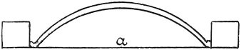

  
[Intangible Textual Heritage](../../index)  [Age of Reason](../index.md) 
[Index](index.md)   
[XIII. Theoretical Writings on Architecture Index](dvs015.md)  
  [Previous](0782)  [Next](0784.md) 

------------------------------------------------------------------------

[Buy this Book at
Amazon.com](https://www.amazon.com/exec/obidos/ASIN/0486225739/internetsacredte.md)

------------------------------------------------------------------------

*The Da Vinci Notebooks at Intangible Textual Heritage*

### 783.

 

In an arch judiciously weighted the thrust is oblique, so that the
triangle *c n b* has no weight upon it.

------------------------------------------------------------------------

[Next: 784.](0784.md)
