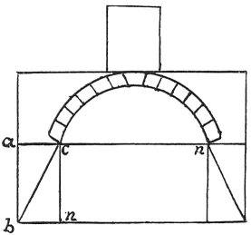

  
[Intangible Textual Heritage](../../index)  [Age of Reason](../index) 
[Index](index)   
[XIII. Theoretical Writings on Architecture Index](dvs015)  
  [Previous](0783)  [Next](0785) 

------------------------------------------------------------------------

[Buy this Book at
Amazon.com](https://www.amazon.com/exec/obidos/ASIN/0486225739/internetsacredte)

------------------------------------------------------------------------

*The Da Vinci Notebooks at Intangible Textual Heritage*

### 784.

 

I here ask what weight will be needed to counterpoise and resist the
tendency of each of these arches to give way?

 [405](#fn_71)

------------------------------------------------------------------------

### Footnotes

[89:405](0784.htm#fr_71) : The two lower
sketches are taken from the MS. S. K. M. III, 10a; they have there no
explanatory text.

------------------------------------------------------------------------

[Next: 785.](0785)
