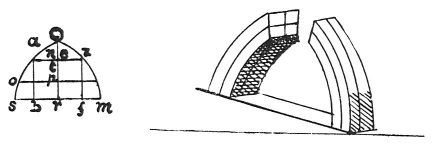

  
[Intangible Textual Heritage](../../index)  [Age of Reason](../index.md) 
[Index](index.md)   
[XIII. Theoretical Writings on Architecture Index](dvs015.md)  
  [Previous](0785)  [Next](0787.md) 

------------------------------------------------------------------------

[Buy this Book at
Amazon.com](https://www.amazon.com/exec/obidos/ASIN/0486225739/internetsacredte.md)

------------------------------------------------------------------------

*The Da Vinci Notebooks at Intangible Textual Heritage*

### 786.

### ON THE STRENGTH AND NATURE OF ARCHES, AND WHERE THEY ARE STRONG OR WEAK; AND THE SAME AS TO COLUMNS.

That part of the arch which is nearer to the horizontal offers least
resistance to the weight placed on it.

p. 92

 

When the triangle *a z n*, by settling, drives backwards the 2/3 of each
1/2 circle that is *a s* and in the same way *z m*, the reason is that
*a* is perpendicularly over *b* and so likewise *z* is above *f*.

Either half of an arch, if overweighted, will break at 2/3 of its
height, the point which corresponds to the perpendicular line above the
middle of its bases, as is seen at *a b*; and this happens because the
weight tends to fall past the point *r*.--And if, against its nature it
should tend to fall towards the point *s* the arch *n s* would break
precisely in its middle. If the arch *n s* were of a single piece of
timber, if the weight placed at *n* should tend to fall in the line *n
m*, the arch would break in the middle of the arch *e m*, otherwise it
will break at one third from the top at the point a because from *a* to
*n* the arch is nearer to the horizontal than from *a* to *o* and from
*o* to *s*, in proportion as *p t* is greater than *t n*, *a o* will be
stronger than *a n* and likewise in proportion as *s o* is stronger than
*o a*, *r p* will be greater than *p t*.

The arch which is doubled to four times of its thickness will bear four
times the weight that the single arch could carry, and more in
proportion as the diameter of its thickness goes a smaller number of
times into its length. That is to say that if the thickness of the
single arch goes ten times into its length, the thickness of the doubled
arch will go five times into its length. Hence as the thickness of the
double arch goes only half as many times into its length as that of the
single arch does, it is reasonable that it should carry half as much
more weight as it would have to carry if it were in direct proportion to
the single arch. Hence as this double arch has 4 times the thickness of
the single arch, it would seem that it ought to bear 4 times the weight;
but by the above rule it is shown that it will bear exactly 8 times as
much.

p. 93

### THAT PIER, WHICH IS CHARGED MOST UNEQUALLY, WILL SOONEST GIVE WAY.

The column *c b*, being charged with an equal weight, \[on each side\]
will be most durable, and the other two outward columns require on the
part outside of their centre as much pressure as there is inside of
their centre, that is, from the centre of the column, towards the middle
of the arch.

Arches which depend on chains for their support will not be very
durable.

### THAT ARCH WILL BE OF LONGER DURATION WHICH HAS A GOOD ABUTMENT OPPOSED TO ITS THRUST.

 

The arch itself tends to fall. If the arch be 30 braccia and the
interval between the walls which carry it be 20, we know that 30 cannot
pass through the 20 unless 20 becomes likewise 30. Hence the arch being
crushed by the excess of weight, and the walls offering insufficient
resistance, part, and afford room between them, for the fall of the
arch.

But if you do not wish to strengthen the arch with an iron tie you must
give it such abutments as can resist the thrust; and you can do this
thus: fill up the spandrels *m n* with stones, and direct the lines of
the joints between them to the centre of the circle of the arch, and the
reason why this makes the arch durable is this. We know very well that
if the arch is loaded with an excess of weight above its quarter as *a
b*, the wall *f g* will be thrust outwards because the arch would yield
in that direction; if the other quarter *b c* were loaded, the wall *f
g* would be thrust inwards, if it were not for the line of stones *x y*
which resists this.

------------------------------------------------------------------------

[Next: 787.](0787.md)
