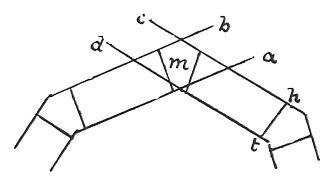

  
[Intangible Textual Heritage](../../index)  [Age of Reason](../index) 
[Index](index)   
[XIII. Theoretical Writings on Architecture Index](dvs015)  
  [Previous](0786)  [Next](0788) 

------------------------------------------------------------------------

[Buy this Book at
Amazon.com](https://www.amazon.com/exec/obidos/ASIN/0486225739/internetsacredte)

------------------------------------------------------------------------

*The Da Vinci Notebooks at Intangible Textual Heritage*

### 787.

### PLAN.

Here it is shown how the arches made in the side of the octagon thrust
the piers

p. 94

 

of the angles outwards, as is shown by the line *h c* and by the line *t
d* which thrust out the pier *m*; that is they tend to force it away
from the centre of such an octagon.

------------------------------------------------------------------------

[Next: 788.](0788)
