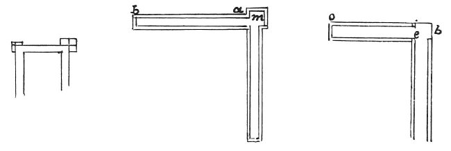

  
[Intangible Textual Heritage](../../index)  [Age of Reason](../index) 
[Index](index)   
[XIII. Theoretical Writings on Architecture Index](dvs015)  
  [Previous](0789)  [Next](0791) 

------------------------------------------------------------------------

[Buy this Book at
Amazon.com](https://www.amazon.com/exec/obidos/ASIN/0486225739/internetsacredte)

------------------------------------------------------------------------

*The Da Vinci Notebooks at Intangible Textual Heritage*

### 790.

The heaviest part of the foundations of buildings settles most, and
leaves the lighter part above it separated from it.

And the soil which is most pressed, if it be porous yields most.

You should always make the foundations project equally beyond the weight
of the walls and piers, as shown at *m a b*. If you do as many do, that
is to say if you make a foundation of equal width from the bottom up to
the surface of the ground, and charge

 

it above with unequal weights, as shown at *b e* and at *e o*, at the
part of the foundation at *b e*, the pier of the angle will weigh most
and thrust its foundation downwards, which the wall at *e o* will not
do; since it does not cover the whole of its foundation, and therefore
thrusts less heavily and settles less. Hence, the pier *b e* in settling
cracks and parts from the wall *e o*. This may be seen in most buildings
which are cracked round the piers.

------------------------------------------------------------------------

[Next: 791.](0791)
