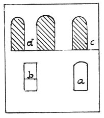

  
[Intangible Textual Heritage](../../index)  [Age of Reason](../index) 
[Index](index)   
[XIII. Theoretical Writings on Architecture Index](dvs015)  
  [Previous](0790)  [Next](0792) 

------------------------------------------------------------------------

[Buy this Book at
Amazon.com](https://www.amazon.com/exec/obidos/ASIN/0486225739/internetsacredte)

------------------------------------------------------------------------

*The Da Vinci Notebooks at Intangible Textual Heritage*

### 791.

 

The window *a* is well placed under the window *c*, and the window *b*
is badly placed under the pier *d*, because this latter is without
support and foundation; mind therefore never to make a break under the
piers between the windows.

------------------------------------------------------------------------

[Next: 792.](0792)
