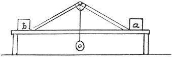

  
[Intangible Textual Heritage](../../index)  [Age of Reason](../index) 
[Index](index)   
[XIII. Theoretical Writings on Architecture Index](dvs015)  
  [Previous](0793)  [Next](0795) 

------------------------------------------------------------------------

[Buy this Book at
Amazon.com](https://www.amazon.com/exec/obidos/ASIN/0486225739/internetsacredte)

------------------------------------------------------------------------

*The Da Vinci Notebooks at Intangible Textual Heritage*

### 794.

 

If the beams and the weight *o* are 100 pounds, how much weight will be
wanted at *a b* to resist such a weight, that it may not fall down?

------------------------------------------------------------------------

[Next: 795.](0795)
