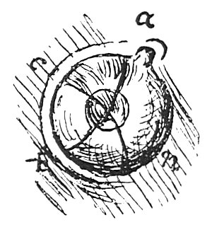

  
[Intangible Textual Heritage](../../index)  [Age of Reason](../index) 
[Index](index)   
[XIV. Anatomy, Zoology and Physiology Index](dvs016)  
  [Previous](0829)  [Next](0831) 

------------------------------------------------------------------------

[Buy this Book at
Amazon.com](https://www.amazon.com/exec/obidos/ASIN/0486225739/internetsacredte)

------------------------------------------------------------------------

*The Da Vinci Notebooks at Intangible Textual Heritage*

### 830.

 

*a b n* is the membrane which closes the eye from below, upwards, with
an opaque film, *c n b* encloses the eye in front and behind with a
transparent membrane.

It closes from below, upwards, because it \[the eye\] comes downwards.

When the eye of a bird closes with its two lids, the first to close is
the nictitating membrane which closes from the lacrymal duct over to the
outer corner of the eye; and the outer lid closes from below upwards,
and these two intersecting motions begin first from the lacrymatory
duct, because we have already seen that in front and below birds are
protected and use only the upper portion of the eye from fear of birds
of prey which come down from above and behind; and they uncover first
the membrane from the outer corner, because if the enemy comes from
behind, they have the power of escaping to the front; and again the
muscle called the nictitating membrane is transparent, because, if the
eye had not such a screen, they could not keep it open against the wind
which strikes against the eye in the rush of their rapid flight. And the
pupil of the eye dilates and contracts as it sees a less or greater
light, that is to say intense brilliancy.

------------------------------------------------------------------------

[Next: 831.](0831)
