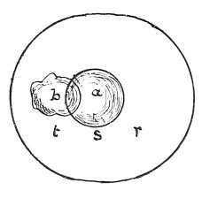

  
[Intangible Textual Heritage](../../index)  [Age of Reason](../index.md) 
[Index](index.md)   
[XV. Astronomy Index](dvs018.md)  
  [Previous](0860)  [Next](0862.md) 

------------------------------------------------------------------------

[Buy this Book at
Amazon.com](https://www.amazon.com/exec/obidos/ASIN/0486225739/internetsacredte.md)

------------------------------------------------------------------------

*The Da Vinci Notebooks at Intangible Textual Heritage*

### 861.

 

Let the earth turn on which side it may the surface of the waters will
never move from its spherical form, but will always remain equidistant
from the centre of the globe.

Granting that the earth might be removed from the centre of the globe,
what would happen to the water?

It would remain in a sphere round that centre equally thick, but the
sphere would have a smaller diameter than when it enclosed the earth.

 [443](#fn_109.md)

------------------------------------------------------------------------

### Footnotes

[138:443](0861.htm#fr_109.md) : Compare No. 896,
lines 48-64; and No. 936.

------------------------------------------------------------------------

[Next: 862.](0862.md)
