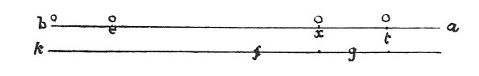

  
[Intangible Textual Heritage](../../index)  [Age of Reason](../index.md) 
[Index](index.md)   
[XV. Astronomy Index](dvs018.md)  
  [Previous](0869)  [Next](0871.md) 

------------------------------------------------------------------------

[Buy this Book at
Amazon.com](https://www.amazon.com/exec/obidos/ASIN/0486225739/internetsacredte.md)

------------------------------------------------------------------------

*The Da Vinci Notebooks at Intangible Textual Heritage*

### 870.

p. 142

### PERSPECTIVE.

Among objects moved from the eye at equal distance, that undergoes least
diminution which at first was most remote.

When various objects are removed at equal distances farther from their
original position, that which was at first the farthest from the eye
will diminish least. And the proportion of the diminution will be in
proportion to the relative distance of the objects from the eye before
they were removed.

That is to say in the object *t* and the object *e* the proportion of
their distances from the eye *a* is quintuple. I remove each from its
place and set it farther from the eye by one of the 5 parts

 

into which the proposition is divided. Hence it happens that the nearest
to the eye has doubled the distance and according to the last
proposition but one of this, is diminished by the half of its whole
size; and the body *e*, by the same motion, is diminished 1/5 of its
whole size. Therefore, by that same last proposition but one, that which
is said in this last proposition is true; and this I say of the motions
of the celestial bodies which are more distant by 3500 miles when
setting than when overhead, and yet do not increase or diminish in any
sensible degree.

------------------------------------------------------------------------

[Next: 871.](0871.md)
