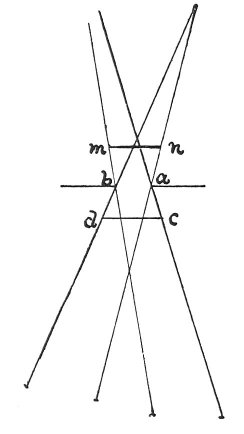

  
[Intangible Textual Heritage](../../index)  [Age of Reason](../index.md) 
[Index](index.md)   
[XV. Astronomy Index](dvs018.md)  
  [Previous](0870)  [Next](0872.md) 

------------------------------------------------------------------------

[Buy this Book at
Amazon.com](https://www.amazon.com/exec/obidos/ASIN/0486225739/internetsacredte.md)

------------------------------------------------------------------------

*The Da Vinci Notebooks at Intangible Textual Heritage*

### 871.

*a b* is the aperture through which the sun passes, and if you could
measure the size of the solar rays at *n m*, you could accurately trace
the real lines of the convergence of the solar rays, the mirror being at
*a b*, and then show the reflected rays at

p. 143

 

equal angles to *n m*; but, as you want to have them at *n m*, take them
at the. inner side of the aperture at *c d*, where they maybe measured
at the spot where the solar rays fall. Then place your mirror at the
distance *a b*, making the rays *d b*, *c a* fall and then be reflected
at equal angles towards *c d*; and this is the best method, but you must
use this mirror always in the same month, and the same day, and hour and
instant, and this will be better than at no fixed time because when the
sun is at a certain distance it produces a certain pyramid of rays.

------------------------------------------------------------------------

[Next: 872.](0872.md)
