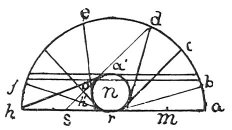

  
[Intangible Textual Heritage](../../index)  [Age of Reason](../index.md) 
[Index](index.md)   
[XV. Astronomy Index](dvs018.md)  
  [Previous](0871)  [Next](0873.md) 

------------------------------------------------------------------------

[Buy this Book at
Amazon.com](https://www.amazon.com/exec/obidos/ASIN/0486225739/internetsacredte.md)

------------------------------------------------------------------------

*The Da Vinci Notebooks at Intangible Textual Heritage*

### 872.

 

*a*, the side of the body in light and shade *b*, faces the whole
portion of the hemisphere bed *e f*, and does not face any part of the
darkness of the earth. And the same occurs at the point *o*; therefore
the space a *o* is throughout of one and the same brightness, and s
faces only four degrees of the hemisphere *d e f g h*, and also the
whole of the earth *s h*, which will render it darker; and how much must
be demonstrated by calculation.  [450](#fn_116.md)

------------------------------------------------------------------------

### Footnotes

[143:450](0872.htm#fr_116.md) : This passage,
which has perhaps a doubtful right to its place in this connection,
stands in the Manuscript between those given in Vol. I as No. 117 and
No. 427.

------------------------------------------------------------------------

[Next: 873.](0873.md)
