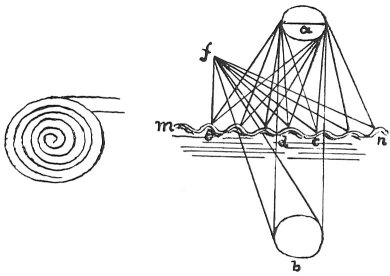

  
[Intangible Textual Heritage](../../index)  [Age of Reason](../index.md) 
[Index](index.md)   
[XV. Astronomy Index](dvs018.md)  
  [Previous](0874)  [Next](0876.md) 

------------------------------------------------------------------------

[Buy this Book at
Amazon.com](https://www.amazon.com/exec/obidos/ASIN/0486225739/internetsacredte.md)

------------------------------------------------------------------------

*The Da Vinci Notebooks at Intangible Textual Heritage*

### 875.

 

The waves in water magnify the image of an object reflected in it.

Let *a* be the sun, and *n m* the ruffled water, *b* the image of the
sun when the water is smooth. Let *f* be the eye which sees the image in
all the waves included within the base of the triangle *c e f*. Now the
sun reflected in the unruffled surface occupied the space *c d*, while
in the ruffled surface it covers all the watery space *c e* (as is
proved in the 4th of my

p. 145

\[paragraph continues\] "Perspective")
 [453](#fn_119.md) and it will cover more of the
water in proportion as the reflected image is remote from the eye
\[10\].

 [454](#fn_120.md)

The image of the sun will be more brightly shown in small waves than in
large ones--and this is because the reflections or images of the sun are
more numerous in the small waves than in large ones, and the more
numerous reflections of its radiance give a larger light than the fewer.

Waves which intersect like the scales of a fir cone reflect the image of
the sun with the greatest splendour; and this is the case because the
images are as many as the ridges of the waves on which the sun

 

shines, and the shadows between these waves are small and not very dark;
and the radiance of so many reflections together becomes united in the
image which is transmitted to the eye, so that these shadows are
imperceptible.

That reflection of the sun will cover most space on the surface of the
water which is most remote from the eye which sees it.

Let *a* be the sun, *p q* the reflection of the sun; *a b* is the
surface of the water, in which the sun is mirrored, and *r* the eye
which sees this reflection on the surface of the water occupying the
space *o m*. *c* is the eye at a greater distance from the surface of
the water and also from the reflection; hence this reflection covers a
larger space of water, by the distance between *n* and *o*.

------------------------------------------------------------------------

### Footnotes

[145:453](0875.htm#fr_119.md) 9: *Nel quarto della
mia prospettiva*. If this reference is to the diagrams accompanying the
text--as is usual with Leonardo--and not to some particular work, the
largest of the diagrams here given must be meant. It is the lowest and
actually the fifth, but he would have called it the fourth, for the text
here given is preceded on the same page of the manuscript by a passage
on whirlpools, with the diagram belonging to it also reproduced here.
The words *della mia prospettiva* may therefore indicate that the
diagram to the preceding chapter treating on a heterogeneal subject is
to be excluded. It is a further difficulty that this diagram belongs
properly to lines 9-10 and not to the preceding sentence. The reflection
of the sun in water is also discussed in the Theoretical part of the
Book on Painting; see Vol. I, No. 206, 207.

[145:454](0875.htm#fr_120.md) : In the original
sketch, inside the circle in the first diagram, is written *Sole* (sun),
and to the right of it *luna* (moon). Thus either of these heavenly
bodies may be supposed to fill that space. Within the lower circle is
written *simulacro* (image). In the two next diagrams at the spot here
marked *L* the word *Luna* is written, and in the last *sole* is written
in the top circle at *a*.

------------------------------------------------------------------------

[Next: 876.](0876.md)
