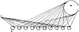

  
[Intangible Textual Heritage](../../index)  [Age of Reason](../index) 
[Index](index)   
[XV. Astronomy Index](dvs018)  
  [Previous](0875)  [Next](0877) 

------------------------------------------------------------------------

[Buy this Book at
Amazon.com](https://www.amazon.com/exec/obidos/ASIN/0486225739/internetsacredte)

------------------------------------------------------------------------

*The Da Vinci Notebooks at Intangible Textual Heritage*

### 876.

p. 146

It is impossible that the side of a spherical mirror, illuminated by the
sun, should reflect its radiance unless this mirror were undulating or
filled with bubbles.

You see here the sun which lights up the moon, a spherical mirror, and
all of its surface, which faces the sun is rendered radiant.

Whence it may be concluded that what shines in the moon is water like
that of our seas, and in waves as that is; and that portion which does
not shine consists of islands and terra firma.

[  
Click to enlarge](img/v214600.jpg)

This diagram, of several spherical bodies interposed between the eye and
the sun, is given to show that, just as the reflection of the sun is
seen in each of these bodies, in the same way that image may be seen in
each curve of the waves of the sea; and as in these many spheres many
reflections of the sun are seen, so in many waves there are many images,
each of which at a great distance is much magnified to the eye. And, as
this happens with each wave, the spaces

p. 147

interposed between the waves are concealed; and, for this reason, it
looks as though the many suns mirrored in the many waves were but one
continuous sun; and the shadows, mixed up with the luminous images,
render this radiance less brilliant than that of the sun mirrored in
these waves.

 [455](#fn_121)

------------------------------------------------------------------------

### Footnotes

[147:455](0876.htm#fr_121) : In the original,
at letter *A* in the diagram "*Sole*" (the sun) is written, and at *o*
"*occhio*" (the eye).

------------------------------------------------------------------------

[Next: 877.](0877)
