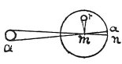

  
[Intangible Textual Heritage](../../index)  [Age of Reason](../index.md) 
[Index](index.md)   
[XV. Astronomy Index](dvs018.md)  
  [Previous](0882)  [Next](0884.md) 

------------------------------------------------------------------------

[Buy this Book at
Amazon.com](https://www.amazon.com/exec/obidos/ASIN/0486225739/internetsacredte.md)

------------------------------------------------------------------------

*The Da Vinci Notebooks at Intangible Textual Heritage*

### 883.

p. 151

To measure how many times the diameter of the sun will go into its
course in 24 hours.

 

Make a circle and place it to face the south, after the manner of a
sundial, and place a rod in the middle in such a way as that its length
points to the centre of this circle, and mark the shadow cast in the
sunshine by this rod on the circumference of the circle, and this shadow
will be--let us say-- as broad as from *a* to *n*. Now measure how many
times this shadow will go into this circumference of a circle, and that
will give you the number of times that the solar body will go into its
orbit in 24 hours. Thus you may see whether Epicurus was \[right in\]
saying that the sun was only as large as it looked; for, as the apparent
diameter of the sun is about a foot, and as that sun would go a thousand
times into the length of its course in 24 hours, it would have gone a
thousand feet, that is 300 braccia, which is the sixth of a mile. Whence
it would follow that the course of the sun during the day would be the
sixth part of a mile and that this venerable snail, the sun will have
travelled 25 braccia an hour.

------------------------------------------------------------------------

[Next: 884.](0884.md)
