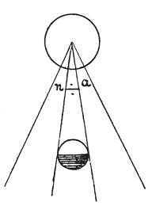

  
[Intangible Textual Heritage](../../index)  [Age of Reason](../index.md) 
[Index](index.md)   
[XV. Astronomy Index](dvs018.md)  
  [Previous](0886)  [Next](0888.md) 

------------------------------------------------------------------------

[Buy this Book at
Amazon.com](https://www.amazon.com/exec/obidos/ASIN/0486225739/internetsacredte.md)

------------------------------------------------------------------------

*The Da Vinci Notebooks at Intangible Textual Heritage*

### 887.

### PROOF THAT THE NEARER YOU ARE TO THE SOURCE OF THE SOLAR RAYS, THE LARGER WILL THE REFLECTION OF THE SUN FROM THE SEA APPEAR TO YOU.

 

 [463](#fn_129.md) If it is from the centre that
the sun employs its radiance to intensify the power of its whole mass,
it is evident that the farther its rays extend, the more widely they
will be divided; and this being so, you, whose eye is near the water
that mirrors the sun, see but a small portion of the rays of the sun
strike the surface of the water, and reflecting the form of the sun. But
if you were near to the sun--as would be the case when the sun is on the
meridian and the sea to the westward--you would see the sun, mirrored in
the

p. 153

sea, of a very great size; because, as you are nearer to the sun, your
eye taking in the rays nearer to the point of radiation takes more of
them in, and a great splendour is the result. And in this way it can be
proved that the moon must have seas which reflect the sun, and that the
parts which do not shine are land.

------------------------------------------------------------------------

### Footnotes

[152:463](0887.htm#fr_129.md) : Lines 4 and fol.
Compare Vol. I, Nos. 130, 131.

------------------------------------------------------------------------

[Next: 888.](0888.md)
